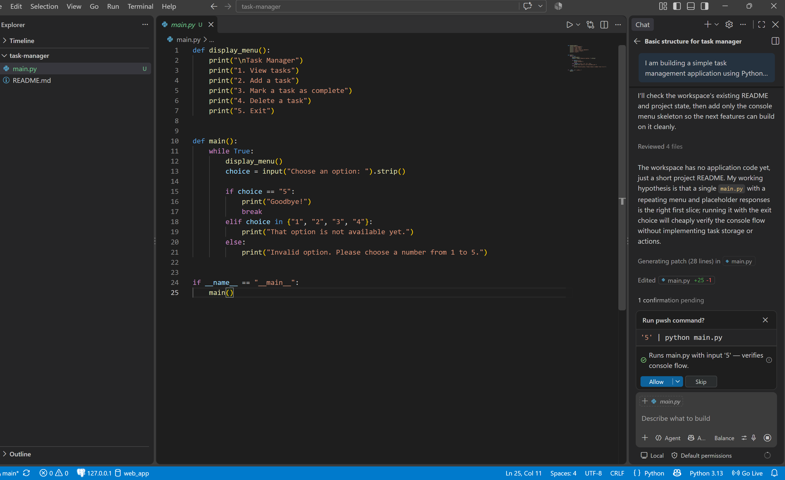
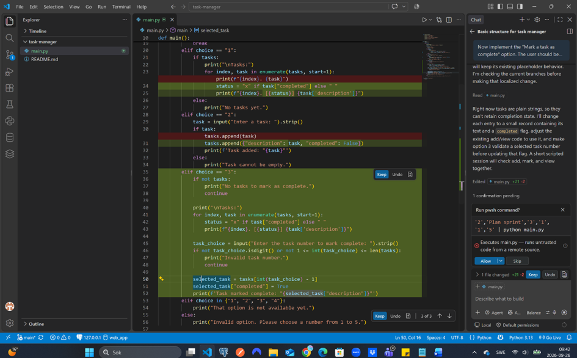
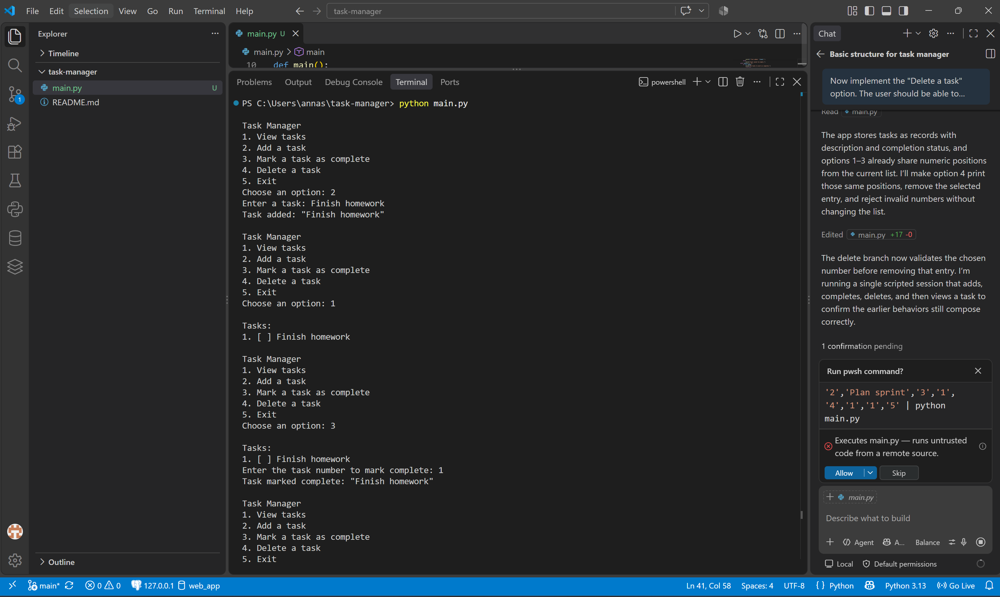
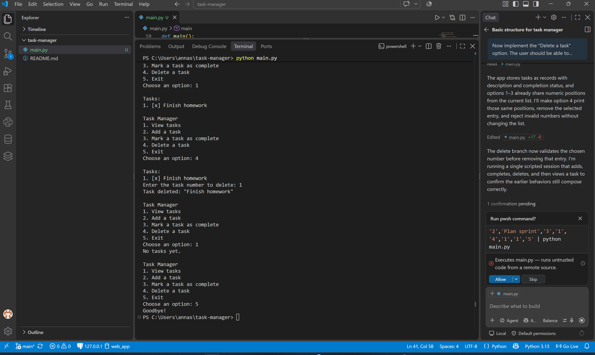
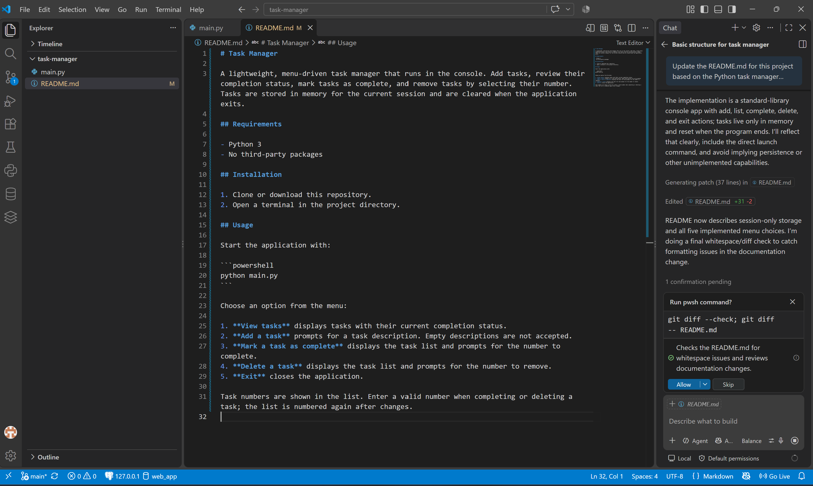
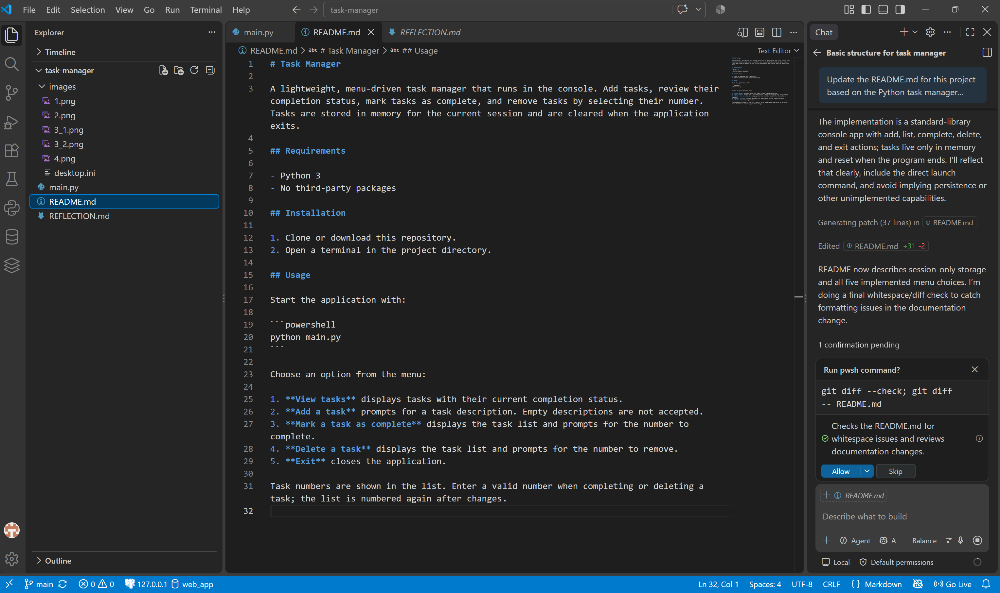

# Reflection

## 1. What did you ask Copilot to help you build? How did you break down the problem?
I asked GitHub Copilot to help me build a simple task management application in Python that runs in the console. Instead of asking Copilot to create the whole application at once, I broke the problem down into smaller steps. I first asked it to create the basic structure and menu without adding all the features. After that, I added one feature at a time: adding tasks, viewing tasks, marking tasks as complete, and deleting tasks. This made it easier for me to understand what Copilot was changing and to test the application as I built it.

## 2. How did your approach to asking questions change as you worked?
At the beginning, my question was more general because I asked Copilot to help me create the basic structure of the application. As I continued, my questions became more specific. I started telling Copilot exactly which feature I wanted to add and also what I did not want it to change yet. For example, when I asked it to add the “Mark a task as complete” feature, I told it to only implement that feature and leave the delete option unchanged. I learned that being more specific made it easier to control what Copilot changed in the program.

## 3. What parts of the development process with GitHub Copilot surprised you?
What surprised me the most was how much Copilot could understand from quite simple instructions. I did not expect it to be able to add each new feature and at the same time understand the code that was already there. I was also surprised when I added the option to mark a task as complete, because Copilot changed how the tasks were stored so it could keep track if a task was completed or not. It showed me that Copilot can do more than just write small parts of code, it can also change the structure when it is needed.

## 4. What did you learn about the technology you used that you didn't know before?
I learned more about how GitHub Copilot can be used when developing a program. Before this assignment, I did not know how effective it could be when you give it clear instructions. I learned that instead of asking it to build everything at once, I can use it step by step and ask it to add one feature at a time. I also learned that even if Copilot writes the code, it is still important to look at the changes and test the program to make sure everything works.

## 5. What would you do differently if you had to build this again?
If I had to build this again, I would probably plan the different features a little more before I started. For example, when we added the option to mark a task as complete, Copilot had to change how the tasks were stored. If I had planned all the features from the beginning, I might have understood earlier what kind of structure the program needed. I would still use Copilot step by step because I think that made it much easier to understand the changes and test that everything was working.

